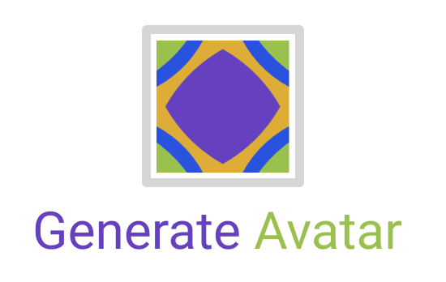
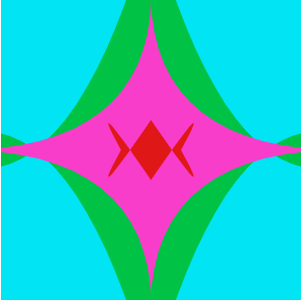

<div align="center">
	
</div>
<p>
<div align="center">
👆 The logo is: `generateFromString('generateavatar')`
</div>
<br/>
</p>

[](http://opensource.org/licenses/MIT)


Check out the example and download your avatar: https://generate-avatar.now.sh/

# Why use Generate Avatar?

A lightweight and blazing fast avatar generator, which is 100% fingerprinted and unique for any input you want.

Pass in your email, uuid, username etc. as an input and it will generate everytime the same unique svg based avatar for you.

Which means you don't have to store any generated images in your database anymore.
It generates those images on the fly wherever you want based on the id, email and so on.

The best thing it's only **5 kB** small, so it can be basically used everywhere you want.

### Install

```
  yarn add generate-avatar
```

or

```
  npm install generate-avatar
```

### How it works

You pass in the string you want and it will return the svg in a string format:

```
  import { generateFromString } from 'generate-avatar'

  generateFromString("example@test.com")
```

This will generate the svg in a string format. In order to use it, you can use the [image data src attribute](https://css-tricks.com/lodge/svg/09-svg-data-uris/) like this:

```

```

This will generate and display the following svg image.



[Try it out here](https://generate-avatar.now.sh/?str=example@test.com) and download the image. You will see that it generates the exact same image everytime. Isn't that amazing ?
